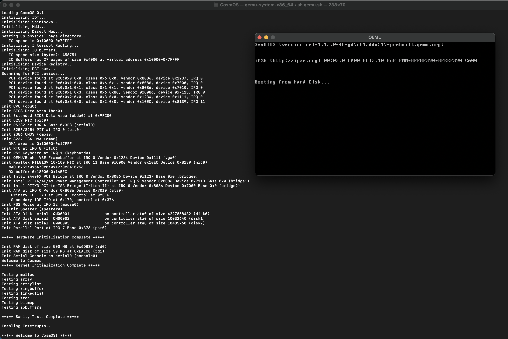

# What is CosmOS?

CosmOS will be an [SSI](https://en.wikipedia.org/wiki/Single_system_image) operating system. The kernel of CosmOS is 64-bit, protected mode. Our strategy is:

- A single process space spanning multiple physical computers
- A single device space spanning multiple physical computers
- A single file system spanning multiple physical computers
- Automatic process migration between nodes
- Support for ARM and i386

## Screen Shot

## Build and Run CosmOS

- [Building and Running CosmOS](doc/developer/build.md)

## Kernel Documentation

- [Source Tree](doc/developer/source_tree.md)
- [Devices](doc/developer/devices.md)
- [Device Status](doc/developer/device_status.md)
- [Block Devices](doc/developer/block_devices.md)
- [VFS](doc/developer/cosmos_vfs.md)
- [Memory Map](doc/developer/memory_map.md)
- [Collections](doc/developer/collections.md)
- [Assertions](doc/developer/assertions.md)
- [kprintf](doc/developer/kprintf_conversion_specifiers.md)
- [Interrupts](doc/developer/interrupts.md)
- [Console](doc/developer/kernel_terminal_console.md)
- [Keyboard](doc/developer/keyboard.md)
- [IO Buffers](doc/developer/io_buffers.md)
- [Strings](doc/developer/strings.md)
- File Systems
  - [Trivial File System (TFS)](doc/developer/filesystems/trivial_file_system.md)
  - [Cosmos File System (CFS) Disk Format](doc/developer/filesystems/cosmos_disk_format.md)

## Debugging

- [Debugging the kernel](doc/debugging/debug.md)

## Contributing

- [CosmOS coding standards](doc/contributing/coding_standards.md)
- [Operating System Development Resources](doc/contributing/osdev_resources.md)

## License

- [License](LICENSE)
